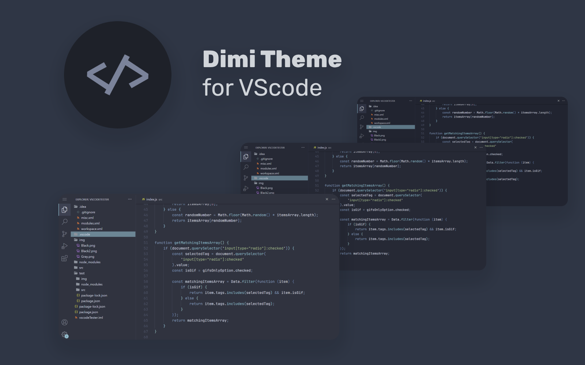

# Dimi Theme



#

## Recommended Editor Settings

```
{
    "editor.fontFamily": "JetBrains Mono",
    "editor.cursorBlinking": "smooth",
    "editor.cursorSmoothCaretAnimation": "on",
    "editor.fontSize": 14.4,
    "editor.lineHeight": 1.5,
    "editor.fontLigatures": true,
    "editor.smoothScrolling": true,
    "terminal.integrated.fontFamily": "JetBrains Mono",
    "terminal.integrated.fontSize": 14.4,
    "terminal.integrated.smoothScrolling": true,
    "workbench.colorTheme": "Dimi Theme", // or variants
    "workbench.iconTheme": "Dimi Theme Icons",
    "workbench.list.smoothScrolling": true,
}
```

##### JetBrains Mono Font Download: https://www.jetbrains.com/lp/mono/

#

## Colour Palette

<details>

|                                                                    |                                                                    |
| ------------------------------------------------------------------ | ------------------------------------------------------------------ |
|  `#000000` |  `#8fbcbb` |
|  `#2e3440` |  `#ff5a5a` |
|  `#3b4252` |  `#d08770` |
|  `#434c5e` |  `#ebcb8b` |
|  `#4c566a` |  `#a3be8c` |
|  `#616e88` |  `#b48ead` |
|  `#5e81ac` |  `#d8dee9` |
|  `#81a1c1` |  `#e5e9f0` |
|  `#88c0d0` |  `#eceff4` |

<summary>Dimi Theme</summary>

</details>
<details>

<summary>Dimi Theme (Dark)</summary>

|                                                                         |                                                                         |
| ----------------------------------------------------------------------- | ----------------------------------------------------------------------- |
|  `#000000` |  `#8fbcbb` |
|  `#242a36` |  `#bf616a` |
|  `#2e3440` |  `#ff5a5a` |
|  `#313848` |  `#c67d66` |
|  `#394254` |  `#d08770` |
|  `#424c60` |  `#e1c181` |
|  `#4c566a` |  `#ebcb8b` |
|  `#57647e` |  `#99b482` |
|  `#616e88` |  `#a3be8c` |
|  `#5477a2` |  `#aa84a3` |
|  `#5e81ac` |  `#b48ead` |
|  `#7797b7` |  `#ced4df` |
|  `#81a1c1` |  `#d8dee9` |
|  `#85b2b1` |  `#dbdfe6` |
|  `#8fbcbb` |  `#e2e5ea` |
|  `#7eb6c6` |  `#eceff4` |

</details>
<details>

<summary>Dimi Theme (Darker)</summary>

|                                                                           |                                                                           |
| ------------------------------------------------------------------------- | ------------------------------------------------------------------------- |
|  `#000000` |  `#88c0d0` |
|  `#1f2531` |  `#ff5a5a` |
|  `#2e3440` |  `#bf616a` |
|  `#2c3343` |  `#c17861` |
|  `#343d4f` |  `#d08770` |
|  `#3d475b` |  `#dcbc7c` |
|  `#525f79` |  `#ebcb8b` |
|  `#4c566a` |  `#94af7d` |
|  `#616e88` |  `#a3be8c` |
|  `#4f729d` |  `#a57f9e` |
|  `#5e81ac` |  `#b48ead` |
|  `#7292b2` |  `#c9cfda` |
|  `#81a1c1` |  `#d6dae1` |
|  `#80adac` |  `#dde0e5` |
|  `#8fbcbb` |  `#d8dee9` |
|  `#79b1c1` |  `#eceff4` |

</details>

#

## Tweaks & Theming

If you want to play around with new colours, use the settings `workbench.colorCustomizations` and `editor.tokenColorCustomizations` in `settings.json` to customize the currently selected theme.

#### **Enable Italics**

```
"editor.tokenColorCustomizations": {
        "[Dimi Theme], [Dimi Theme (Dark)], [Dimi Theme (Darker)]": {
            "textMateRules": [
                {
                    "scope": [
                        "comment",
                        "keyword",
                        "keyword.operator.expression",
                        "storage",
                        "variable.language",
                        "support.function.construct.output.php"
                    ],
                    "settings": {
                        "fontStyle": "italic"
                    }
                },
                {
                    "scope": [
                        "keyword.operator",
                        "keyword.other.unit",
                        "storage.type.function.arrow.js"
                    ],
                    "settings": {
                        "fontStyle": ""
                    }
                }
            ]
        }
    }
```

#### **Enable Bold Keywords**

```
"editor.tokenColorCustomizations": {
        "[Dimi Theme], [Dimi Theme (Dark)], [Dimi Theme (Darker)]": {
            "textMateRules": [
                {
                    "scope": [
                        "keyword",
                        "keyword.operator.expression",
                        "storage",
                        "variable.language",
                        "support.function.construct.output.php"
                    ],
                    "settings": {
                        "fontStyle": "bold"
                    }
                },
                {
                    "scope": [
                        "keyword.operator",
                        "keyword.other.unit",
                        "storage.type.function.arrow.js"
                    ],
                    "settings": {
                        "fontStyle": ""
                    }
                }
            ]
        }
    }
```

#

## Contributing

See something strange? Please report [here](https://github.com/Dimi15/dimi-theme/issues). A screenshot would be great for clarification purposes.

#

## Installation

1. Open the extensions sidebar on Visual Studio Code
2. Search for Dimi Theme
3. Click Install to install it
4. Click Reload to reload your editor
5. Code/File ＞ Preferences ＞ Color Theme ＞ Dimi Theme
